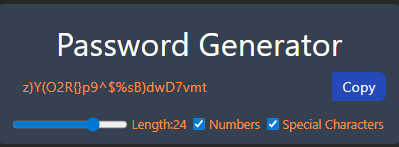

# 🔐 PasswordGenerator

**PasswordGenerator** is a simple, yet powerful web app built with **React**, **Vite**, and **Tailwind CSS**.  
It allows users to quickly generate secure passwords with customizable options — no backend required, just frontend magic.

---

## 🌐 Live Demo

🚀 **Generate your password here:**  
👉 https://password-generator-react-chai.vercel.app/

---

## 📸 Screenshots

### Generate Password


---

## 🚀 Features

- 🧠 Generate passwords with configurable criteria: length, inclusion of numbers, symbols, uppercase/lowercase letters  
- 🎨 Built with React hooks and modern frontend architecture  
- 🖌 Styled with Tailwind CSS for utility-first, responsive design  
- ⚡ Built with Vite for fast development & build times  

---

## 🛠️ Tech Stack & Tools

| Category         | Technologies                            |
|------------------|----------------------------------------|
| Frontend         | React (functional components + hooks)  |
| Build & Tooling  | Vite                                  |
| Styling          | Tailwind CSS                           |
| Logic            | JavaScript (state handling, password generation) |

---

## 📋 Getting Started

### Prerequisites  
- Node.js (v14 or higher recommended)  
- npm (or Yarn)  

### Installation  
1. **Clone the repository**  
     ```bash
     git clone https://github.com/TasinTausif/PasswordGenerator.git
     cd PasswordGenerator

2. Install dependencies
    ```bash
     npm install

3. Run the development server
   ```bash
   npm run dev

4. Open that URL (typically http://localhost:5173) in your browser.

## 🎮 How to Use

Use the sliders or inputs to set your password length

Toggle options like: include numbers, include symbols, uppercase letters, exclude similar characters

Click the “Generate Password” button

The generated password appears — copy it or regenerate with new options
